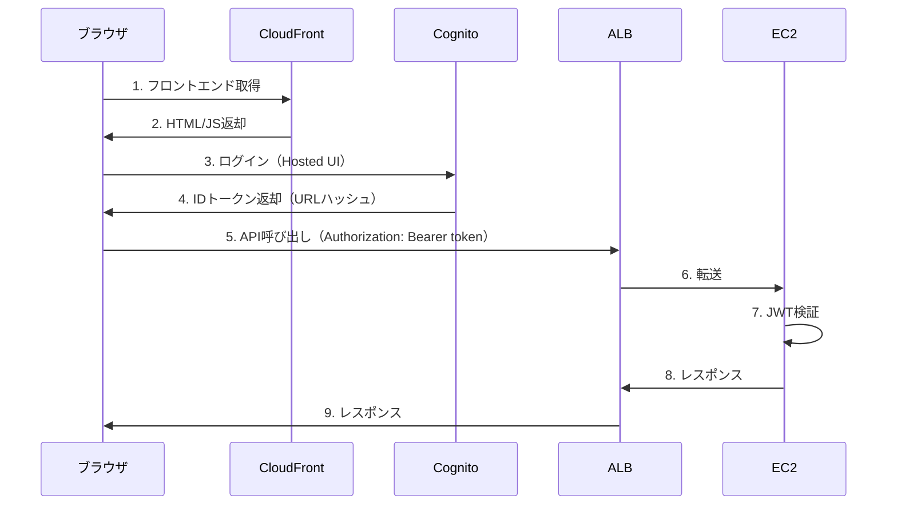

# ALB + Cognito認証 + CloudFront 最小構成デモ

## 構成

```
CloudFront (S3) → ブラウザJS → ALB → EC2 (JWT検証)
                      ↓
                  Cognito (トークン発行)
```

## 認証フロー



※ EC2側でCognito JWTを検証。ALBは単純転送のみ。

## デプロイ手順

### 1. CloudShellでクローン

```bash
git clone https://github.com/TORIFUKUKaiou/alb-cognito-demo.git
cd alb-cognito-demo
```

### 2. 依存関係インストール

```bash
npm install
```

### 3. CDK Bootstrap（初回のみ）

```bash
npx cdk bootstrap
```

### 4. デプロイ

```bash
npx cdk deploy
```

出力例：
- `CloudFrontUrl` - フロントエンドURL
- `AlbDns` - API URL
- `UserPoolClientId` - Cognito Client ID
- `CognitoDomain` - Cognito認証URL

### 5. CognitoにコールバックURL追加

デプロイ後、Cognitoコンソールで設定が必要：

1. Cognito → User pools → `alb-demo-pool` → App integration
2. App client `WebClient` を選択
3. Hosted UI → Edit
4. Allowed callback URLs に `CloudFrontUrl` を追加
   - 例: `https://d1234567890.cloudfront.net/`
5. Save changes

## テスト手順

### 1. フロントエンドにアクセス

`CloudFrontUrl` にブラウザでアクセス

### 2. 設定入力

出力された値を入力：
- Cognito Domain
- Client ID
- ALB URL

### 3. ログイン

「Login with Cognito」ボタン → Cognito Hosted UI → サインアップ/ログイン

### 4. API呼び出し

ログイン後、「Call API」ボタンでEC2にリクエスト

## 3分待機テスト

「Call API (3min)」ボタンで180秒待機テスト。ALBにはタイムアウト制限がないため、長時間処理が可能。

## 削除

```bash
npx cdk destroy
```

## 注意事項

- EC2側でJWT検証を行うパターン（ALB認証機能は未使用）
- 本番環境ではALBにHTTPS設定推奨
- Cognito Hosted UIのコールバックURL設定が必要
