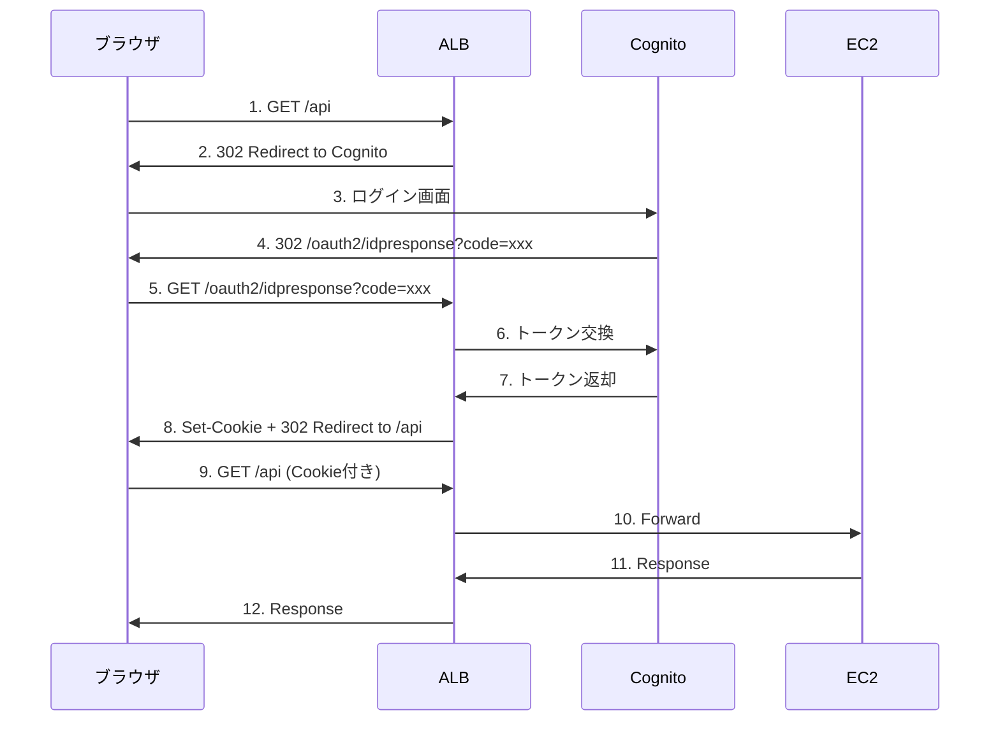

# ALB + Cognito認証 + CloudFront 最小構成デモ

## 構成

```
CloudFront (S3) → ブラウザJS → ALB (Cognito認証) → EC2
```

## 認証フロー



※ フロントエンドJS側でトークン管理は不要。ALBがCognito認証を代行する。

## デプロイ手順

### 1. CloudShellでクローン

```bash
git clone https://github.com/TORIFUKUKaiou/alb-cognito-demo.git
cd alb-cognito-demo
```

### 2. 依存関係インストール

```bash
npm install
```

### 3. CDK Bootstrap（初回のみ）

```bash
npx cdk bootstrap
```

### 4. デプロイ

```bash
npx cdk deploy
```

出力例：
- `CloudFrontUrl` - フロントエンドURL
- `AlbDns` - API URL（Cognito認証付き）
- `UserPoolId` - Cognito User Pool ID

## テスト手順

### 1. Cognitoユーザー登録

出力された `AlbDns` に直接ブラウザでアクセス：

```
http://<AlbDns>/
```

→ Cognito認証画面にリダイレクトされる
→ 「Sign up」でユーザー登録（メール認証あり）
→ ログイン完了後、EC2からのレスポンスが表示される

### 2. フロントエンドからAPIコール

`CloudFrontUrl` にアクセス：

1. ALB URLを入力欄にペースト
2. 「Call API」ボタンでAPIコール
3. 「Call API (3min)」で180秒待機テスト

## 3分待機テスト

ALBにはAPI Gatewayのような29秒タイムアウト制限がないため、長時間処理が可能。

```
http://<AlbDns>/?wait=180
```

## 削除

```bash
npx cdk destroy
```

## 注意事項

- この構成はALB側でCognito認証を処理するパターン
- フロントエンドJS側でのトークン管理（Amplify Auth等）は含まない
- 本番環境ではALBにHTTPS（証明書）設定が必要
