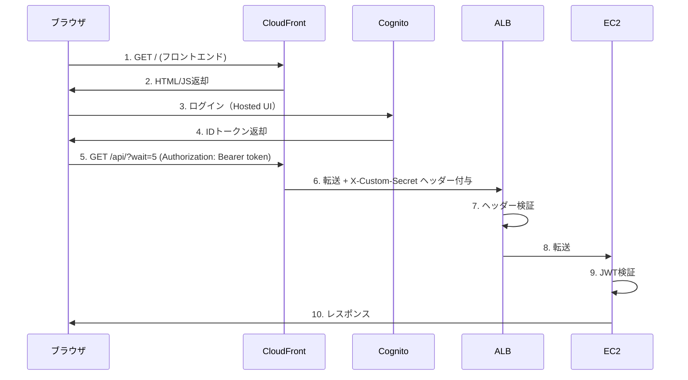

# ALB + Cognito認証 + CloudFront 最小構成デモ

## 構成

```
CloudFront ─┬→ / (S3: フロントエンド)
            └→ /api/* (ALB → EC2)
                 ↓
            カスタムヘッダー検証
```

## セキュリティ

1. **CloudFront → ALB**: カスタムヘッダー（`X-Custom-Secret`）で検証
   - ALBに直接アクセスしても403 Forbidden
2. **EC2**: JWT検証（Cognitoトークン必須）

## 認証フロー



## デプロイ手順

```bash
git clone https://github.com/TORIFUKUKaiou/alb-cognito-demo.git
cd alb-cognito-demo
npm install
npx cdk bootstrap  # 初回のみ
npx cdk deploy
```

## テスト手順

1. `CloudFrontUrl` にアクセス
2. Cognito Domain と Client ID を入力
3. 「Login with Cognito」でログイン
4. 「Call API」でAPI呼び出し

### ALB直接アクセスの確認

```bash
curl http://<AlbDns>/
# → {"error": "Forbidden"} (403)
```

CloudFront経由でないとアクセス不可。

## 3分待機テスト

「Call API (3min)」ボタンで180秒待機テスト。

## 削除

```bash
npx cdk destroy
```
